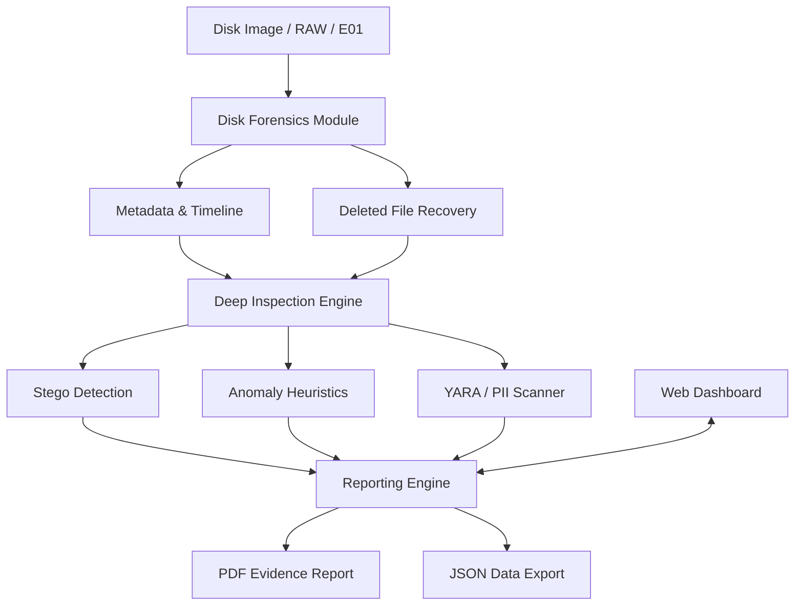

# 🛡️ DeepTrace: Advanced Forensic Intelligence


> **Enterprise-grade forensic investigation platform designed for disk image analysis, deleted artifact recovery, and advanced steganography detection.**

---

## 🎯 Overview

The **DeepTrace Forensic System** is a comprehensive tool designed for forensic analysts and SOC teams. It simulates a real-world cybercrime investigation workflow, moving from disk acquisition to deep heuristic analysis and culminating in professional evidence reporting.

### 🚀 Key Capabilities
*   **🔍 Disk Forensics**: Deep parsing of RAW and E01 images with deleted file carving.
*   **🕵️ Stego Detection**: Heuristic LSB (Least Significant Bit) analysis to find hidden payloads.
*   **⚠️ Anomaly Hunting**: Entropy-based encryption detection and magic byte mismatch identification.
*   **🔐 Integrity & Hashing**: Automated MD5/SHA256 generation for forensic chain of custody.
*   **📊 Timeline Reconstruction**: Chronological mapping of system activity and file events.
*   **📑 Professional Reporting**: Automated generation of SOC-ready PDF and JSON reports.

---

## 🧱 System Architecture



---

## 🛠️ Tech Stack

| Category | Technology |
| :--- | :--- |
| **Language** | Python 3.10+ |
| **Forensics** | `pytsk3`, `pyewf`, `regipy` |
| **Analysis** | `yara-python`, `python-magic`, `numpy` |
| **UI/UX** | Flask, Socket.IO, Tailwind CSS, Chart.js |
| **Reporting** | ReportLab Platypus |

---

## 📁 Folder Structure

```text
project/
├── core/           # Disk analysis & Metadata extraction
├── stego/          # LSB detection & Payload carving
├── analysis/       # Entropy, YARA, PII, and Anomalies
├── integrity/      # Forensic hashing (MD5/SHA256)
├── report/         # PDF/JSON generation & Timeline builder
├── ui/             # Web Dashboard (Flask templates/static)
├── data/           # Rules, Uploads, and Generated Reports
└── main.py         # Unified system entry point
```

---

## 🚀 Getting Started

### 1. Installation
```bash
# Clone the repository
git clone https://github.com/prajwal-2201/DeepTrace
cd forensics-system

# Install dependencies
pip install -r requirements.txt
```

### 2. Launch the Dashboard
```bash
python3 main.py
```
Visit `http://localhost:5000` to access the Enterprise Forensic Workspace.

---

## 🎬 The "Demo Story"

**Scenario**: *Exfiltration via Steganography*
"We simulated a case where a suspect hid sensitive company blueprints inside high-resolution images and then deleted them to avoid detection. Using this system, we:
1. **Recovered** the deleted JPG files from the unallocated space.
2. **Detected** suspicious LSB entropy flagging hidden data.
3. **Extracted** the hidden payload using the magic-byte carver.
4. **Generated** a court-ready PDF report documenting the entire chain of evidence."

---

## 📑 Sample Report Features
*   **Executive Summary**: High-level statistical overview of the scan.
*   **Threat Intelligence**: Table of YARA matches and PII leaks.
*   **Chronological Timeline**: Step-by-step reconstruction of file activity.
*   **Evidence List**: Every file with associated MD5/SHA256 hashes.

---

## ⚖️ License
This project is licensed under the MIT License - see the [LICENSE](LICENSE) file for details.

*Developed for Professional Forensic Analysis & SOC Operations.*
